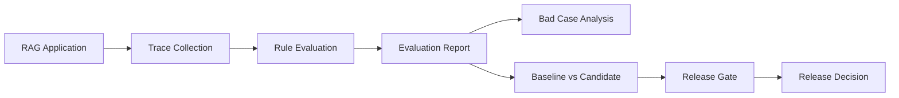

# RAGOps

面向 RAG 应用的 Trace 驱动质量评估与发布门禁 SDK

Framework-agnostic quality infrastructure for tracing, deterministic evaluation, bad-case analysis, experiment comparison, and release gating.


## 项目定位

普通 RAG Demo 通常只关注“能否回答”，但真实迭代还需要知道：检索是否为空、
检索分数是否过低、请求是否过慢、候选配置是否引入回归，以及当前版本是否应该
进入下一阶段。

RAGOps 将这些问题组织成一条以 Trace（一次 RAG 请求的完整运行记录）为起点的
质量闭环。它接收统一 Trace，对运行结果进行规则评估、Bad Case 分析、
baseline/candidate 对比和发布门禁判断。

RAGOps 不负责文档解析、向量库管理或大模型调用，也不绑定具体 RAG 框架。
现有应用只需将自己的运行结果映射为统一 Trace，即可复用后续质量流程。

## 一图看懂



- 在线链路负责记录 Trace。
- 离线链路负责确定性评估和决策。
- 当前发布门禁只生成建议，不自动部署。

## 核心能力

| 模块 | 作用 | 主要对象 |
|---|---|---|
| Trace Schema | 统一记录问题、检索片段与分数、模型、回答、延迟和反馈 | `Trace` |
| TracedRagRunner | 包装现有 RAG Pipeline，执行一次并返回原结果与 `trace_id` | `TracedRagRunner`、`RagTracePayload` |
| TraceCollector | 按追加顺序保存和读取 UTF-8 JSONL Trace | `TraceCollector` |
| RuleBasedEvaluator | 使用确定性规则评估单条或多条 Trace | `RuleBasedEvaluator`、`EvaluationResult` |
| EvaluationReport | 汇总通过率、失败 Trace 和各类问题次数，并保留单条结果 | `EvaluationReport` |
| OfflineEvaluationRunner | 串联 Trace 读取、批量评估和报告保存 | `OfflineEvaluationRunner`、`EvaluationReportCollector` |
| IssueAnalyzer | 将失败评估与源 Trace 关联，并按问题类型分组 | `IssueAnalyzer`、`IssueAnalysisReport` |
| ExperimentComparator | 比较覆盖相同 Trace 的 baseline/candidate 报告 | `ExperimentComparator`、`ExperimentComparison` |
| ReleaseGate | 根据实验对比和策略生成确定性发布建议 | `ReleaseGate`、`ReleasePolicy`、`ReleaseDecision` |
| ReleaseDecisionCollector | 保存完整发布决策及其源 ExperimentComparison | `ReleaseDecisionCollector` |

## 设计原则

1. **Framework-agnostic**：不绑定 LangChain、LlamaIndex、FAISS 或具体模型；
   应用通过结果映射函数接入。

2. **Deterministic first**：当前评估和门禁基于确定性规则，不调用 LLM Judge，
   结果可以重复计算和解释。

3. **Source-preserving**：EvaluationReport 保留单条结果，ExperimentComparison
   保留两份源报告，ReleaseDecision 保留源 comparison，以支持重新校验和审计。

4. **Failure semantics**：在线 Trace 默认 fail-open，避免日志故障影响主业务；
   离线评估和发布门禁 fail-closed，读取、评估或保存异常会直接暴露。

## 快速开始

要求 Python >= 3.11。运行依赖只有 Pydantic 2，本地持久化使用 UTF-8 JSONL。

从仓库根目录进行 editable install：

```bash
python -m pip install -e ".[dev]"
```

下面的示例用 `result_mapper` 将任意 Pipeline 返回值转换为 RAGOps 所需字段：

```python
from pathlib import Path

from ragops.tracing import RagTracePayload, TraceCollector, TracedRagRunner


def rag_pipeline(query: str) -> dict:
    return {
        "answer": "示例回答",
        "chunks": ["示例检索片段"],
        "scores": [0.91],
    }


def result_mapper(result: dict) -> RagTracePayload:
    return RagTracePayload(
        retrieval_chunks=result["chunks"],
        retrieval_scores=result["scores"],
        answer=result["answer"],
    )


runner = TracedRagRunner(
    TraceCollector(Path("outputs") / "ragops_traces.jsonl"),
    result_mapper=result_mapper,
    prompt_version="qa_v1",
    model="example-model",
)

run = runner.run("用户问题", rag_pipeline)
print(run.result)    # 原始 Pipeline 返回值
print(run.trace_id)  # 持久化失败时为 None
```

Pipeline 自身失败时异常原样抛出。Pipeline 成功但 Trace 映射、校验或保存失败时，
默认 `fail_open=True` 会记录异常并返回原始结果，不会重复调用 Pipeline；设置
`fail_open=False` 后，Trace 阶段异常也会原样抛出。

## 完整质量闭环

### 1. 采集 Trace

在线应用通过上面的 `TracedRagRunner` 保存 Trace。离线流程可以按保存顺序读取：

```python
from pathlib import Path

from ragops.tracing import TraceCollector

trace_collector = TraceCollector(
    Path("outputs") / "ragops_traces.jsonl"
)
traces = trace_collector.list_traces()
```

### 2. 生成评估报告

`RuleBasedEvaluator.evaluate()` 用于单条检查，`evaluate_many()` 返回批量
`EvaluationReport`。`OfflineEvaluationRunner` 复用批量接口并保存报告：

```python
from pathlib import Path

from ragops.evaluation import (
    EvaluationReportCollector,
    OfflineEvaluationRunner,
    RuleBasedEvaluator,
)
from ragops.tracing import TraceCollector

trace_collector = TraceCollector(
    Path("outputs") / "ragops_traces.jsonl"
)
evaluator = RuleBasedEvaluator()
traces = trace_collector.list_traces()

single_result = evaluator.evaluate(traces[0])
batch_report = evaluator.evaluate_many(traces)

report_collector = EvaluationReportCollector(
    Path("outputs") / "evaluation_reports.jsonl"
)
report = OfflineEvaluationRunner(
    trace_collector,
    evaluator,
    report_collector,
).run()

print(single_result.passed)
print(batch_report.issue_counts)
print(report.total_count, report.pass_rate, report.failed_trace_ids)
```

### 3. 分析 Bad Case

`IssueAnalyzer` 将失败结果关联回源 Trace，保留问题、检索与回答上下文：

```python
from ragops.analysis import IssueAnalyzer

analysis = IssueAnalyzer().analyze(report, traces)
print(analysis.total_bad_cases)
print(analysis.issue_groups)

for bad_case in analysis.bad_cases:
    print(bad_case.trace.query)
    print(bad_case.trace.answer)
    print(bad_case.evaluation.issues)
```

### 4. 对比候选配置

`ExperimentComparator` 要求两份报告覆盖相同 Trace 集合，并保留 baseline 顺序：

```python
from ragops.experiments import ExperimentComparator

reports = report_collector.list_reports()
baseline_report, candidate_report = reports[-2:]

comparison = ExperimentComparator().compare(
    baseline_report,
    candidate_report,
)
print(comparison.pass_rate_delta)
print(comparison.improved_trace_ids)
print(comparison.regressed_trace_ids)
print(comparison.issue_count_deltas)
```

负的 issue delta 表示候选报告中的该问题数量减少。

### 5. 执行发布门禁

发布门禁只读取已生成的 ExperimentComparison，不重新执行 RAG 或评估：

```python
from pathlib import Path

from ragops.release import (
    ReleaseDecisionCollector,
    ReleaseGate,
    ReleaseGateRunner,
)
from ragops.schemas import ReleasePolicy

runner = ReleaseGateRunner(
    ReleaseGate(),
    ReleaseDecisionCollector(
        Path("outputs") / "release_decisions.jsonl"
    ),
)
decision = runner.run(
    comparison,
    ReleasePolicy(
        min_candidate_pass_rate=0.8,
        min_pass_rate_delta=0.0,
        max_regressed_trace_count=0,
        max_total_issue_increase=0,
    ),
)

print(decision.approved)
print(decision.reasons)
print(decision.candidate_pass_rate)
print(decision.pass_rate_delta)
print(decision.regressed_trace_count)
print(decision.total_issue_increase)
```

## 当前规则

`RuleBasedEvaluator` 默认使用三条规则：

- 无检索片段：`no_retrieval`
- 最高检索分数低于 `0.25`：`low_retrieval_score`
- 延迟超过 `30000 ms`：`high_latency`

这些规则评估的是检索和运行状态，不代表答案语义正确。

## 真实接入验证

RAGOps 已接入真实 RAG 应用 [StudyRAG](https://github.com/yeeyangba-1/StudyRAG)。
验收链路为：

```text
StudyRAG
→ 运行相同 Benchmark Case
→ 生成 baseline/candidate Trace
→ 分别评估
→ Bad Case 分析
→ 实验对比
→ Release Gate
```

| 验收项 | 结果 |
|---|---:|
| Benchmark Case | 3 |
| baseline Trace | 3 |
| candidate Trace | 3 |
| baseline pass rate | 1.0 |
| candidate pass rate | 1.0 |
| pass rate delta | 0.0 |
| improved | 0 |
| regressed | 0 |
| release decision | approved |
| Embedding | 成功加载 |
| DeepSeek API | 成功调用 |
| 输出产物 | 五类全部生成 |

该结果证明完整集成链路可以运行，并且候选配置没有出现规则层面的回归；由于两套
配置结果相同，不能据此认为 candidate 优于 baseline。仓库不提交真实回答内容、
API Key 或验收 `outputs` 目录。

## 数据流与持久化

| 文件 | 内容 | 产生方式 |
|---|---|---|
| `ragops_traces.jsonl` | 一行一条完整 Trace | `TraceCollector` |
| `evaluation_reports.jsonl` | 一行一份批量评估报告 | `EvaluationReportCollector` |
| `release_decisions.jsonl` | 一行一份发布决策及其源 comparison | `ReleaseDecisionCollector` |

当前持久化是本地单进程 JSONL MVP，不提供数据库事务、跨进程锁或自动部署。

## 项目结构

```text
.
├── src/
│   └── ragops/
│       ├── schemas/
│       ├── tracing/
│       ├── evaluation/
│       ├── analysis/
│       ├── experiments/
│       └── release/
├── tests/
├── docs/
├── pyproject.toml
└── README.md
```

## 当前边界

当前不包含：

- LLM Judge
- 答案语义正确性评分
- Web UI
- Web API
- 数据库
- 自动调参
- 自动部署
- 自动回滚
- CI/CD 发布编排
- 分布式追踪

RAGOps 当前定位是本地、确定性、可复用的 RAG 质量评估 MVP。

## 开发验证

```bash
python -m pytest
python -m pip check
python -m compileall -q src tests
```
