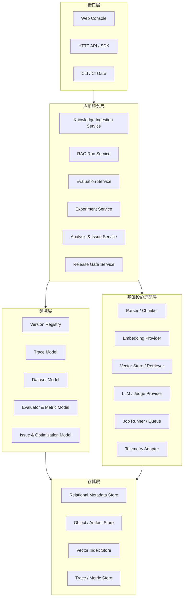
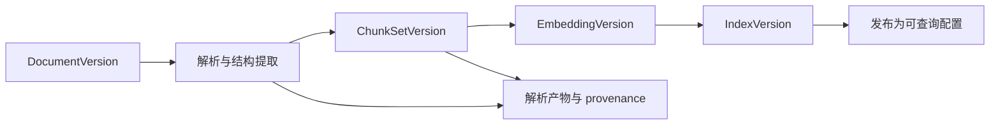
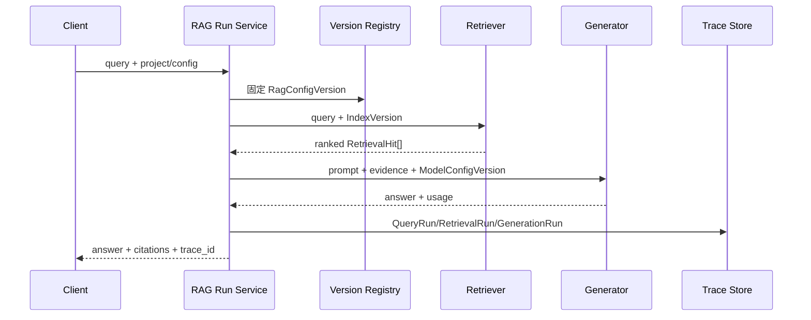
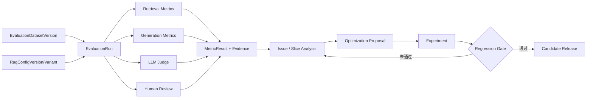

# RAGOps 初步系统架构

## 1. 文档状态

- 状态：Sprint 0 初稿
- 性质：架构方向，不是最终技术选型
- 输入：`docs/CODE_AUDIT.md` 中固定提交的代码审计
- 约束：本阶段不实现业务代码；后续选型需通过 ADR 和最小验证确认

## 2. 项目定位

RAGOps 是面向知识库场景的 RAG 应用质量评测与持续优化平台。

它不是 StudyRAG 的学习助手复制版，也不是 SearchInsight 的八 Agent 展示版。平台以可追溯的 RAG 运行数据为基础，统一管理知识库与配置版本、离线/在线评测、Bad Case、实验对比和发布门禁，形成持续优化闭环。

核心目标：

1. 让每个回答都能还原“使用了什么数据、索引、配置、模型和证据”。
2. 让检索、生成、性能和用户反馈分别可测量、可切片、可比较。
3. 让质量问题能够进入实验，并用回归结果证明优化是否有效。

非目标：

- 不固化为课程学习、售后搜索等单一业务应用。
- 不以 Agent 数量作为架构目标。
- 不在首个版本建设通用大模型训练平台。
- 不直接自动修改生产 Prompt、知识库或检索配置。

## 3. 用户场景

### 3.1 RAG 应用开发者

- 调试一次回答的检索片段、rank、分数、Prompt、模型输出和耗时。
- 对比 chunk、embedding、top-k、rerank、Prompt 或模型版本。
- 在合并或发布前运行固定回归集，阻止质量退化。

### 3.2 知识库运营人员

- 发现无召回、错误召回、知识缺口、过期文档和引用不一致。
- 将 Bad Case 关联到具体文档/chunk，并跟踪补充或修订结果。
- 按主题、来源、时间和知识库版本观察质量趋势。

### 3.3 质量评测人员

- 管理评测数据集、参考答案、相关文档标注和切片标签。
- 组合确定性指标、规则、LLM Judge 和人工复核。
- 查看 evaluator 版本、失败/降级状态和 Judge 一致性。

### 3.4 平台维护者

- 管理模型/provider、任务执行、权限、成本、审计和数据保留策略。
- 监控评测任务与线上 trace 的成功率、延迟和资源消耗。

## 4. 架构原则

1. **领域与基础设施分离：** 核心用例不直接依赖 Streamlit、DeepSeek、FAISS 或 CSV。
2. **契约先行：** 先定义 trace、评测和版本模型，再选择存储和工作流技术。
3. **不可变版本：** 文档、索引、Prompt、模型配置和数据集发布后以新版本演进。
4. **产物可追溯：** 派生数据必须能追溯输入快照、执行配置和代码/evaluator 版本。
5. **同步与异步分离：** 在线查询保持短链路；批量评测、Judge、报表作为后台任务。
6. **确定性步骤不用 Agent：** 校验、清洗、统计等由普通服务完成；LLM evaluator 是可选适配器。
7. **失败显式化：** 成功、失败、跳过和降级是不同状态，不用 fallback 结果冒充正式评测。
8. **安全默认开启：** 最小权限、敏感字段脱敏、租户隔离、审计与保留期进入基础设计。

## 5. 逻辑架构

这是一张职责图，不代表首个版本必须部署为多个微服务。MVP 建议采用模块化单体和后台 worker，通过清晰边界保留未来拆分能力。

## 6. 关键数据流

### 6.1 知识入库与索引

每个 chunk 必须保留文档版本、页码/段落、字符范围、解析器版本和内容哈希，解决 StudyRAG 只有 `chunk_id` 的溯源缺口。

### 6.2 在线 RAG 运行与 trace

trace 写入失败不应静默丢失；具体采用同步保证、异步补偿还是 outbox，需要在 Sprint 1 用 ADR 决定。

### 6.3 离线评测与优化闭环

## 7. 模块划分

### 7.1 `knowledge`

负责文档接入、解析、切分、provenance、embedding 和索引版本。解析器、切分器、embedding 与向量存储均通过接口注入。

### 7.2 `rag_runtime`

负责一次可追溯 RAG 运行：固定配置版本、检索、可选 rerank、Prompt 构造、生成、引用和 trace。它不负责批量质量分析。

### 7.3 `evaluation`

负责数据集、评测运行、evaluator registry 和指标结果。建议先支持：

- 检索：Recall@K、MRR、nDCG、Hit Rate、无召回率。
- 生成：答案相关性、faithfulness、引用覆盖/正确性、拒答正确性。
- 系统：成功率、端到端耗时、各阶段耗时、token 和成本。
- 反馈：显式反馈、隐式行为和人工标签；三者不得混为同一个质量分数。

具体指标需由产品场景和标注可用性确认，不能直接照搬 SearchInsight 的硬编码规则。

### 7.4 `experiments`

负责变体、运行矩阵、基线对比、显著性/置信区间和回归门禁。实验只引用不可变版本，不直接修改生产配置。

### 7.5 `analysis`

负责切片、趋势、Bad Case 多标签分类、issue 聚合和优化建议。建议必须保留证据与来源，允许人工确认或驳回。

### 7.6 `orchestration`

负责后台任务、重试、取消、超时和状态机。仅当流程需要分支、恢复或长任务时引入工作流框架，不把每个函数包装为 Agent。

### 7.7 `platform`

负责项目/工作区、身份权限、provider secrets、审计、配额、数据保留和系统可观测性。

### 7.8 `interfaces`

提供 API、Web Console、SDK/CLI。界面只调用应用用例，不直接操作向量索引、DataFrame 或模型 client。

## 8. 数据模型设计方向

### 8.1 身份与范围

| 实体 | 关键字段方向 | 说明 |
|---|---|---|
| `Workspace` | `id`, `name`, `retention_policy` | 权限与数据隔离边界 |
| `Project` | `id`, `workspace_id`, `name`, `status` | 一套 RAG 应用及其评测资产 |

### 8.2 知识与配置版本

| 实体 | 关键字段方向 | 说明 |
|---|---|---|
| `KnowledgeBase` | `id`, `project_id`, `name` | 逻辑知识库 |
| `DocumentVersion` | `id`, `document_id`, `content_hash`, `source`, `parser_version` | 不可变文档版本 |
| `Chunk` | `id`, `document_version_id`, `content`, `page`, `span`, `metadata` | 可定位的证据单元 |
| `IndexVersion` | `id`, `chunk_set_version`, `embedding_config_version`, `status` | 可发布/回滚的索引 |
| `PromptVersion` | `id`, `template`, `variables`, `content_hash` | 不可变 Prompt |
| `ModelConfigVersion` | `id`, `provider`, `model`, `parameters` | embedding/generation/judge 配置 |
| `RagConfigVersion` | `id`, `index_version_id`, `retrieval`, `rerank`, `prompt_version_id`, `model_config_version_id` | 一次运行的完整配置快照 |

### 8.3 运行与证据

| 实体 | 关键字段方向 | 说明 |
|---|---|---|
| `QueryRun` | `id/trace_id`, `project_id`, `query`, `rag_config_version_id`, `status`, `started_at`, `latency_ms` | 一次端到端运行 |
| `RetrievalRun` | `id`, `query_run_id`, `index_version_id`, `top_k`, `latency_ms` | 检索阶段 |
| `RetrievalHit` | `retrieval_run_id`, `chunk_id`, `rank`, `raw_score`, `normalized_score` | 排名与 provenance |
| `GenerationRun` | `id`, `query_run_id`, `prompt_version_id`, `model_config_version_id`, `answer`, `usage`, `cost`, `status` | 生成阶段 |
| `Citation` | `generation_run_id`, `chunk_id`, `answer_span` | 回答与证据的显式连接 |
| `Feedback` | `id`, `query_run_id`, `type`, `value`, `actor`, `created_at` | 独立的反馈事实 |

### 8.4 评测与实验

| 实体 | 关键字段方向 | 说明 |
|---|---|---|
| `EvaluationDatasetVersion` | `id`, `dataset_id`, `content_hash`, `schema_version` | 可复现数据集快照 |
| `EvaluationCase` | `id`, `dataset_version_id`, `query`, `expected_answer`, `relevant_chunk_refs`, `tags` | 单个评测样本 |
| `EvaluationRun` | `id`, `dataset_version_id`, `rag_config_version_id`, `code_version`, `status` | 批量评测 |
| `EvaluatorVersion` | `id`, `type`, `implementation/prompt/model version`, `parameters` | 规则/指标/Judge/人工 rubric |
| `MetricResult` | `evaluation_run_id`, `case_id`, `evaluator_version_id`, `metric`, `value`, `status`, `evidence` | 原子评测结果 |
| `Issue` | `id`, `source_result_ids`, `taxonomy`, `severity`, `status`, `owner` | 多标签质量问题 |
| `Experiment` | `id`, `baseline_version`, `variant_versions`, `dataset_version_id`, `decision` | 优化验证 |
| `ReleaseGateResult` | `experiment_id`, `policy_version`, `passed`, `reasons` | 可审计门禁 |

### 8.5 模型约束

- 所有主键使用稳定 ID；展示名称不能作为关联键。
- 所有版本实体不可原地修改，使用内容哈希去重。
- 所有运行实体有 `pending/running/succeeded/failed/cancelled` 等显式状态。
- `fallback`、`skipped` 与 `failed` 必须保留，不能只记录一个数值。
- 大文本和二进制产物可放对象存储，关系库保存引用与校验信息。
- schema 需要版本号和迁移策略；CSV 仅作为导入/导出格式，不作为内部事实源。

## 9. 部署方向

MVP 推荐：

- 一个模块化后端应用，承载同步 API 和领域用例。
- 一个后台 worker，执行解析、索引、批量评测、Judge 和报表任务。
- 一个关系型元数据存储。
- 一个对象/产物存储。
- 一个可替换的向量存储适配器。

是否引入消息队列、独立时序/分析库、分布式工作流或多服务部署，应由数据规模、任务时长和可靠性指标驱动，而不是 Sprint 0 预设。

## 10. 待决策事项

以下问题必须在实现前确认并形成 ADR：

1. 首个目标用户与首个知识库场景是什么？
2. MVP 是否需要内置 RAG runtime，还是先接入外部 trace？
3. 首批评测数据和人工标注从哪里来？
4. 必须支持哪些文档格式、语言和数据量？
5. 单租户还是从第一版支持 workspace 隔离？
6. 数据是否允许发送给第三方模型 Judge，脱敏要求是什么？
7. 首版质量门禁采用哪些指标和阈值？
8. 目标部署环境、并发、延迟、成本和保留期要求是什么？

在这些问题确认前，不锁定 Web 框架、数据库、向量库或工作流框架。
