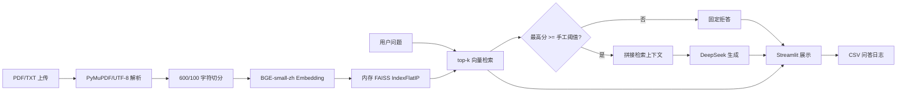
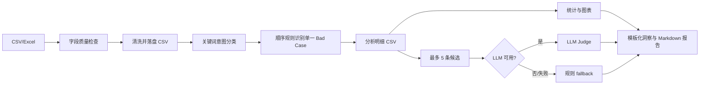

# StudyRAG 与 SearchInsight 代码审计

## 1. 审计范围与方法

本次审计只读取两个原型仓库的 `main` 分支，不修改原仓库，不复制代码，也不实现 RAGOps 功能。

| 项目 | 仓库 | 审计提交 | 提交时间 |
|---|---|---|---|
| StudyRAG | `yeeyangba-1/StudyRAG` | `ab7b6c2c8556e1c96cc9a2d8c85c25666aae2796` | 2026-07-02 16:41:22 +08:00 |
| SearchInsight | `yeeyangba-1/SearchInsight` | `315ee2880f7896a0959546ca501b4050b88554c4` | 2026-07-02 03:17:47 +08:00 |

审计方法：

- 逐文件检查入口、核心模块、依赖、配置、数据样例和文档。
- 使用 `python -m compileall` 对两个仓库的 Python 文件做语法检查，均通过。
- 使用 SearchInsight 自带 `data/search_logs.csv` 运行规则诊断脚本和完整八节点流程；37 条样例中识别出 17 条 Bad Case，LLM API Key 为空时流程以 `fallback` 模式完成。
- 未对 StudyRAG 发起模型调用，因为这会依赖外部 DeepSeek 服务，且不影响静态代码链路判断。

以下结论均对应本节固定的代码快照；文件与行号均为原仓库中的相对位置。

## 2. StudyRAG 审计

### 2.1 项目功能

StudyRAG 是面向课程 PDF/TXT 的单机 Streamlit 学习助手，已经具备一个最小 RAG 闭环：

- 上传和读取 PDF/TXT（`app.py:260-289`，`rag.py:38-43`）。
- 使用 `RecursiveCharacterTextSplitter` 切分文本，以 `BAAI/bge-small-zh` 生成向量，并写入内存 FAISS `IndexFlatIP`（`rag.py:21-33`，`rag.py:113-135`）。
- 检索 top-k 片段并返回 `chunk_id`、文本和相似度分数（`rag.py:167-194`）。
- 使用 DeepSeek 生成回答，并在最高检索分数低于手工阈值时拒答（`rag.py:213-223`，`rag.py:238-265`）。
- 提供智能问答、复习提纲、自动出题、错题解析四种交互（`features.py:20-120`，`app.py:470-539`）。
- 展示检索证据，并将问答追加到 CSV 日志（`app.py:543-554`，`rag_logger.py:10-38`）。
- 可选调用 LLM 从文档前 6000 字推断章节和知识点（`rag.py:48-90`，`rag.py:137-165`）。

### 2.2 文件结构

```text
StudyRAG/
├── app.py                  # Streamlit 页面、会话状态和交互编排
├── rag.py                  # 解析、切分、向量化、FAISS、LLM 与 trace
├── features.py             # 四类学习场景 Prompt 和入口
├── rag_logger.py           # CSV 问答日志
├── requirements.txt
├── .streamlit/config.toml
└── docs/                   # 项目说明材料
```

项目规模较小，运行链路主要集中在 `app.py` 和 `rag.py`；仓库没有测试目录、包配置或 CI 配置。

### 2.3 核心模块

| 模块 | 实际职责 | 审计判断 |
|---|---|---|
| `app.py` | 上传、状态保存、参数输入、功能切换、结果和证据展示 | UI 与业务编排耦合，适合作为原型界面，不适合作为新平台核心 |
| `rag.py` | 文档解析、结构分析、索引、检索、模型调用 | 验证了最小 RAG 链路，但多个基础设施职责集中在一个文件 |
| `features.py` | 学习问答、提纲、出题、错题 Prompt | 体现了场景层与 RAG 核心分离的雏形，但仍直接依赖具体 `KnowledgeBase` |
| `rag_logger.py` | 追加写入问答与检索证据 | 是连接 SearchInsight 的最小数据契约，但字段不足且存储方式仅适合演示 |

### 2.4 数据流程



运行态的文档对象、文本块和 FAISS 索引只保存在 `st.session_state` 与进程内存中（`app.py:226-238`，`app.py:278-287`），重启后不会保留。

### 2.5 可复用内容

“可复用”指复用设计意图或通过重写形成独立模块，不表示原样复制。

| 可复用内容 | 证据 | RAGOps 中的处理方式 |
|---|---|---|
| 带证据的检索返回值 | `rag.py:167-194` | 扩展为含文档版本、页码、rank、原始/归一化分数的 `RetrievalHit` |
| 问答 trace 的最小字段 | `rag_logger.py:10-35` | 升级为带 `trace_id`、版本、耗时、成本和状态的版本化事件模型 |
| 检索不足时拒答 | `rag.py:238-265` | 保留策略接口，但阈值需基于数据集校准，不能沿用固定 `0.25` |
| 文档解析—切分—向量化—索引边界 | `rag.py:38-43`，`rag.py:113-135` | 拆成可替换的 ingestion pipeline 和 provider adapter |
| 场景层 Prompt 与检索核心分离 | `features.py` | 发展为版本化 Prompt/应用配置，不将学习场景固化到平台核心 |

### 2.6 存在的问题

#### 高优先级

1. **缺少可复现的版本链路。** 日志没有知识库、文档、chunk、索引、embedding、Prompt、生成模型或配置版本；同一条 query 无法还原当时运行条件（`rag_logger.py:10-35`）。
2. **证据溯源不足。** PDF 页面被直接拼接，chunk 只保存整数下标和文本，没有文件 ID、页码或字符位置（`rag.py:38-40`，`rag.py:123-127`）。
3. **状态与索引不持久。** 知识库和 FAISS 均在单进程内存，无法支持多用户、重启恢复、索引版本或回滚（`rag.py:95-110`，`app.py:226-238`）。
4. **质量判断未经校准。** 用最高向量相似度和固定 `0.25` 判断是否拒答，未区分 query 类型、索引版本或分数分布，也没有评测数据证明阈值有效（`rag.py:238-255`）。
5. **没有自动化测试。** 检索、拒答、日志序列化、文档解析和 Prompt 行为都没有回归保护。

#### 中优先级

1. `rag.py` 同时负责 provider 配置、解析、切分、索引、检索和生成，UI 又直接操作其内部对象，模块边界不清晰。
2. 只支持文本型 PDF/TXT；无 OCR、表格/图片处理、文件大小限制、恶意文件防护或解析失败分级（`rag.py:38-43`）。
3. DeepSeek client、模型名、embedding 模型和维度在模块或代码中固定，配置校验与 provider 抽象缺失（`rag.py:14-28`，`rag.py:219-222`）。
4. LLM 结构分析只读取前 6000 字，并通过标题字符串启发式定位原文；长文档和生成标题可能映射到错误位置（`rag.py:67-90`，`rag.py:137-165`）。
5. CSV 追加写没有并发控制；`retrieved_docs`、`scores` 以 JSON 字符串嵌套在 CSV 中，不利于查询与演进（`rag_logger.py:25-36`）。
6. 日志声明了 `user_feedback`，但当前问答调用没有采集反馈，始终使用默认空字符串（`app.py:518-523`，`rag_logger.py:19`）。
7. 只有智能问答写日志，提纲、出题和错题解析没有统一 trace（`app.py:512-538`）。
8. 文档内容作为 system message 注入模型，尚无文档提示注入隔离、敏感信息治理或访问控制（`rag.py:213-218`）。

## 3. SearchInsight 审计

### 3.1 项目功能

SearchInsight 是一个面向 AI 搜索/RAG 日志的离线批处理诊断原型：

- 上传 CSV/Excel，并校验六个固定字段：`query`、`answer`、`retrieved_docs`、`user_feedback`、`clicked`、`created_at`（`app.py:267-301`，`engine/pipeline.py:28`）。
- 清洗空值、反馈枚举、空 query 和重复 query（`engine/pipeline.py:105-157`）。
- 用关键词规则做 Query 意图分类和单标签 Bad Case 识别（`tools/search_quality_tools.py:15-111`）。
- 统计意图分布、Bad Case 占比和高风险意图，输出 CSV、PNG 图表和 Markdown 报告（`tools/search_quality_tools.py:114-143`，`tools/search_quality_tools.py:146-354`）。
- 对最多五条规则筛选的低质量样本调用 DeepSeek LLM Judge；无 Key 或调用失败时逐条降级为规则判断（`tools/search_quality_tools.py:357-402`，`tools/search_quality_tools.py:501-583`）。
- 使用 LangGraph 将八个固定节点串联，并在 Streamlit 展示节点结果（`workflow/graph.py:109-183`，`app.py:315-411`）。

### 3.2 文件结构

```text
SearchInsight/
├── app.py                         # Streamlit 页面
├── config.py                      # DeepSeek 与输出目录配置
├── workflow/graph.py              # LangGraph 状态和固定八节点图
├── engine/pipeline.py             # 八个节点的实际处理逻辑
├── tools/search_quality_tools.py  # 规则、统计、Judge、图表和报告
├── tools/analysis_tools.py        # 遗留通用 EDA 工具
├── tools/data_tools.py            # 遗留数据加载工具
├── tools/model_tools.py           # 遗留分类/回归/聚类工具
├── tools/viz_tools.py             # 遗留通用绘图工具
├── templates/prompts.py           # 遗留通用分析 Prompt
├── data/                          # 样例日志与生成脚本
├── scripts/                       # 规则诊断演示脚本
└── outputs/                       # 运行产物
```

当前搜索质量主链路只引用 `tools/search_quality_tools.py`；通用分析、建模、绘图和 Prompt 模块没有被主链路导入，属于早期原型遗留。

### 3.3 Agent/分析流程

README 对 Agent 的定位是“职责清晰的工作流节点”，代码也确实如此：八个节点没有自主规划或动态工具选择，而是固定串行 DAG（`README.md:33-50`，`workflow/graph.py:109-142`）。

| 节点 | 实际动作 | 是否使用 LLM |
|---|---|---|
| TASK | 返回固定任务说明，并透传 `user_query` | 否 |
| QUALITY | 检查列、空值和重复 query | 否 |
| CLEAN | 填充/归一化/删除并保存 CSV | 否 |
| EDA | 规则分类、Bad Case 识别和统计 | 否 |
| VIZ | 从分析 CSV 生成三张图 | 否 |
| EVAL | 汇总 Bad Case，并对最多五条样本 Judge | 可选 |
| INSIGHT | 根据 Bad Case 类型拼装固定建议 | 否 |
| REPORT | 根据模板生成 Markdown | 否 |

因此，SearchInsight 的核心价值在“可解释的诊断流水线”，而不是 Agent 自主性。RAGOps 不应为了保留“八 Agent”形式而复制这层命名。

### 3.4 数据流程



实跑仓库样例得到：37 条 query、17 条 Bad Case、45.95% Bad Case 率；分布为回答过短 7、用户不满意 3、检索为空 3、疑似答非所问 2、知识库未利用 2。该结果仅证明代码可运行，不代表规则已经具备普适准确率。

### 3.5 可复用内容

| 可复用内容 | 证据 | RAGOps 中的处理方式 |
|---|---|---|
| 数据质量检查先于评测 | `engine/pipeline.py:74-111` | 作为 ingestion validation，输出结构化错误而非流程中途异常 |
| 规则初筛 + LLM Judge | `tools/search_quality_tools.py:357-402` | 发展为可配置 evaluator pipeline，记录 evaluator 版本、成本和失败状态 |
| Judge 失败可降级 | `tools/search_quality_tools.py:389-402` | 保留韧性思想，但区分“已评测”和“降级估算”，避免混为同一指标 |
| Bad Case 分类与切片统计 | `tools/search_quality_tools.py:114-143` | 改为多标签 issue taxonomy，并支持按数据集、版本、意图和时间切片 |
| 评测结果到改进建议的映射 | `engine/pipeline.py:223-288` | 形成“发现—证据—建议—实验—验证”的可追踪闭环 |
| 共享状态编排 | `workflow/graph.py:60-103` | 仅在需要重试、分支或长任务时采用工作流引擎；简单步骤用普通服务编排 |

### 3.6 存在的问题

#### 高优先级

1. **规则只适配样例业务词表。** 意图和关键词硬编码了退货、企业微信、200MB、429 等内容，难以迁移到任意知识库场景（`tools/search_quality_tools.py:15-48`）。
2. **Bad Case 是有顺序的单标签判断。** “回答过短”会遮蔽同时存在的检索为空或用户不满意，无法表达一次运行的多重故障（`tools/search_quality_tools.py:60-111`）。
3. **没有评测基准或准确率。** 仓库没有人工标签、gold dataset、混淆矩阵、Judge 一致性测试或阈值校准；45.95% 只是规则在合成样例上的输出。
4. **数据不可追溯、产物会覆盖。** 清洗、分析、图表和报告都写入固定文件名，没有 run ID、输入快照、配置版本或幂等机制（`engine/pipeline.py:40-48`，`tools/search_quality_tools.py:123-125`，`tools/search_quality_tools.py:294-326`）。
5. **没有自动化测试。** 清洗、规则优先级、空数据、Judge JSON、fallback、图表和工作流均无回归测试。

#### 中优先级

1. 八节点是完全固定的串行图，没有条件边、并行、重试或恢复；TASK 节点也不解析用户需求，只返回固定任务（`workflow/graph.py:121-142`，`engine/pipeline.py:51-71`）。
2. `analyze_search_logs()` 和图表/报告默认写相对当前工作目录，而 pipeline 的读取使用项目绝对目录；从非项目根目录启动时可能读写不同位置（`tools/search_quality_tools.py:123-125`，`engine/pipeline.py:26-48`）。
3. 清洗按 query 文本直接去重，会丢失同一 query 在不同时间、用户、模型版本或知识库版本下的有效运行记录（`engine/pipeline.py:143-146`）。
4. LLM Judge 只取候选前五条，不做分层/随机抽样；任何一条失败都会把总体 `mode` 标为 fallback，但结果列表可能混合 LLM 与规则来源（`tools/search_quality_tools.py:357-402`）。
5. LLM 输出仅通过正则提取 JSON，未做字段类型和枚举校验；Judge Prompt、模型和规则没有版本号（`tools/search_quality_tools.py:501-552`，`tools/search_quality_tools.py:586-593`）。
6. `clicked` 被要求、清洗，却没有进入任何质量指标；`created_at` 也未解析或用于趋势分析（`engine/pipeline.py:28`，`engine/pipeline.py:123-124`）。
7. Streamlit 中存在两套页面实现；`app_mode` 唯一选项总会调用 `render_searchinsight_page()` 后 `st.stop()`，因此 `app.py:466-682` 的另一套执行 UI 不可达。
8. `tools/analysis_tools.py`、`data_tools.py`、`model_tools.py`、`viz_tools.py` 和 `templates/prompts.py` 未被当前主链路使用，增加认知和依赖成本。
9. 上传内容、分析明细和报告保存在本地固定目录，无租户隔离、访问控制、保留策略或敏感信息处理（`app.py:21-26`，`app.py:318-320`）。
10. 报告提出知识库、Prompt 和检索建议，但没有关联具体配置版本、责任人、实验或验证结果，尚未形成持续优化闭环。

## 4. 两个项目比较

### 4.1 能力矩阵

| 能力 | StudyRAG | SearchInsight | 关系 |
|---|---|---|---|
| 文档解析/切分/向量索引 | 有 | 无 | StudyRAG 独有 |
| RAG 检索与生成 | 有 | 无 | StudyRAG 独有 |
| 检索证据记录 | 最小实现 | 消费 `retrieved_docs` | 上下游互补 |
| 低质量判断 | 在线分数阈值 | 离线规则 + 可选 Judge | 重复但粒度不同 |
| 问答日志 | CSV 生产 | CSV/Excel 消费 | 接口互补但 schema 不完全兼容 |
| 用户反馈 | 字段存在但未采集 | 作为规则信号 | 设计重复、实现断裂 |
| Bad Case 分析 | 无批量分析 | 有 | SearchInsight 独有 |
| 图表/报告/建议 | 无 | 有 | SearchInsight 独有 |
| 版本化实验与回归门禁 | 无 | 无 | 共同缺口 |
| 自动化测试与可复现评测 | 无 | 无 | 共同缺口 |

### 4.2 重复能力

- 两者都定义了 `query`、`answer`、`retrieved_docs`、`scores/user_feedback` 一类质量日志字段。
- 两者都尝试判断低质量回答：StudyRAG 使用向量最高分，SearchInsight 使用文本规则和可选 LLM Judge。
- 两者都把 DeepSeek 作为直接模型依赖，并以 Streamlit 作为页面与业务编排入口。
- 两者都用文件系统保存运行产物，缺少运行 ID、版本和持久化数据模型。

### 4.3 互补能力

- StudyRAG 提供“产生 RAG 运行与检索证据”的在线链路；SearchInsight 提供“消费运行日志并诊断问题”的离线链路。
- StudyRAG 暴露 top-k 和相似度；SearchInsight 将回答问题归因到检索、知识库、生成或 Prompt。
- StudyRAG 有真实的文档—chunk—检索过程；SearchInsight 有批量统计、Judge fallback、可视化和报告。

### 4.4 整合方式

RAGOps 不应把两个 Streamlit 应用拼在一起，也不应复制“`KnowledgeBase` 单体 + 八 Agent”结构。建议通过一个版本化 trace contract 整合：

1. RAG 运行侧产生结构化 `QueryRun`、`RetrievalRun`、`RetrievalHit` 和 `GenerationRun`。
2. 评测侧读取同一数据模型，运行确定性指标、规则、LLM Judge 和人工标注。
3. 分析侧将多个 `MetricResult` 聚合为可切片的 `Issue`，保留原始证据和 evaluator 版本。
4. 优化建议必须转化为版本化 `Experiment`，比较 Prompt、检索、chunk、embedding 或模型变体。
5. 只有通过离线回归门禁的变体才能成为候选发布版本，发布后继续采集在线反馈。

整合的关键不是复用页面或文件，而是建立“运行—评测—问题—实验—验证”的统一领域模型。

## 5. 对 RAGOps 设计的直接约束

基于上述代码证据，RAGOps 初步设计必须满足：

- **Trace first：** 在开发 RAG 功能前先确定可版本化、可追溯的数据契约。
- **可复现：** 每次运行和评测都绑定数据集快照、知识库/索引、Prompt、模型和 evaluator 版本。
- **确定性优先：** 普通校验、统计和固定步骤不包装成 Agent；LLM 只用于需要语义判断的 evaluator。
- **多信号评测：** 分离检索质量、生成质量、系统质量和用户反馈，允许一个样本产生多个问题标签。
- **离线/在线同构：** 原型日志和未来线上 trace 使用相同核心 schema，不再以手工 CSV 作为系统边界。
- **闭环而非报告终点：** 任何建议都应关联证据、负责人、实验、目标指标和验证结果。
- **模块可替换：** parser、chunker、embedding、vector store、retriever、generator、judge 都通过接口隔离具体供应商。
- **安全与治理：** 原文、query、answer、日志和模型调用需要权限、脱敏、保留期和审计记录。

系统架构和开发阶段详见 `docs/ARCHITECTURE.md` 与 `docs/ROADMAP.md`。
