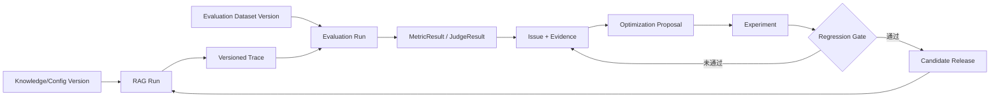

# RAGOps 设计决策记录

## 0. 文档状态

- 阶段：架构设计确认
- 状态：Accepted for MVP planning
- 输入：`docs/CODE_AUDIT.md`、`docs/ARCHITECTURE.md`、`docs/ROADMAP.md`
- 约束：本文件只确认设计方向，不包含业务实现

本文记录 RAGOps 当前阶段已经确认的核心决策。每项决策同时说明工程理由、代价和面试表达，确保后续开发不会只追求 Demo 效果，也避免架构成为无法解释的技术堆砌。

## 1. RAGOps 最终定位

### 决策

RAGOps 定位为：**面向知识库 RAG 应用的质量控制与持续优化平台（RAG Quality Control Plane）**。

平台以一次 RAG 运行产生的完整 trace 为事实基础，管理：

- 知识库、文档、chunk、索引和 RAG 配置版本。
- Query、检索结果、生成回答、引用、耗时、成本和用户反馈。
- 离线评测数据集、指标、规则、LLM Judge 和人工复核。
- Bad Case、问题归因、实验对比、回归门禁和优化结果。

MVP 可以包含一个可追溯的参考 RAG runtime，用来验证数据契约和评测闭环；但平台价值不绑定这个 runtime，未来也能接收外部 RAG 系统的 trace。

### 为什么这样定位

- StudyRAG 已证明“文档—检索—回答—证据”链路可行，但状态、索引和日志仍是单机原型。
- SearchInsight 已证明“日志—规则诊断—Judge—报告”链路可行，但输入是固定 CSV，无法还原具体知识库和配置版本。
- 两个项目之间真正可整合的是运行事实与评测结果，不是两个 Streamlit 页面。

### 明确边界

RAGOps 不是：

- 面向最终用户的通用聊天机器人。
- 课程学习助手或售后搜索应用。
- 通用 Multi-Agent 开发平台。
- 模型训练、微调或向量数据库产品。
- 自动替用户修改生产 Prompt、索引或知识库的自治系统。

### 面试解释

> 两个原型分别解决“怎么产生 RAG 回答”和“怎么分析 RAG 日志”，但中间缺少可追溯的数据契约。RAGOps 的核心不是再做一个问答页面，而是把运行、评测、问题和实验连接成可复现的质量闭环。

## 2. 为什么选择 trace 驱动架构

### 决策

所有运行、评测、分析和实验都围绕版本化 trace 建模。`trace_id` 是一次端到端 RAG 运行的关联入口，而不是只记录 `query` 和 `answer` 的普通日志 ID。

一次完整 trace 至少需要关联：

- `QueryRun`：query、项目、状态、开始时间和总耗时。
- `RagConfigVersion`：索引、retrieval、rerank、Prompt 和模型配置快照。
- `RetrievalRun` 与 `RetrievalHit`：rank、score、chunk 和来源定位。
- `GenerationRun`：输入 Prompt 版本、回答、token、成本和模型状态。
- `Citation`：回答片段与证据 chunk 的关系。
- `Feedback`：独立保存的显式反馈、隐式行为或人工标签。

### 选择理由

1. **可复现。** 没有版本和 trace，就无法判断同一 query 的质量变化来自知识库、chunk、embedding、top-k、Prompt 还是模型。
2. **可诊断。** 检索为空、召回错误、上下文未利用、生成幻觉和系统超时属于不同阶段，必须保留阶段证据。
3. **可评测。** 离线评测可以复用线上 trace schema，不需要像 SearchInsight 一样依赖手工导出的固定 CSV。
4. **可实验。** 基线与候选配置可以在同一数据集快照上重放，并比较质量、延迟和成本。
5. **可审计。** 任何指标、Bad Case 和发布决定都能回到原始运行事实与 evaluator 版本。

### 为什么普通日志不够

StudyRAG 的 CSV 只有 query、answer、retrieved_docs、scores、feedback 和时间；它缺少知识库、文档、索引、Prompt、模型和配置版本。SearchInsight 能对这些字段做统计，但无法回答“问题发生在哪个版本”和“优化后是否真正改善”。

### 代价与控制

| 代价 | 控制方式 |
|---|---|
| trace 数据量增加 | 大文本/产物进入对象存储，关系库保存结构化索引和引用 |
| schema 更复杂 | 契约先行、schema version、迁移和契约测试 |
| 在线写入可能影响延迟 | MVP 先保证关键 trace，不关键明细可异步；具体一致性策略用 ADR 确认 |
| 敏感数据风险增加 | 字段分级、脱敏、最小权限和保留期 |

### 面试解释

> RAG 的回答质量是多个版本化阶段共同作用的结果。trace 驱动不是为了“多记日志”，而是为了让质量问题能够被重放、归因和验证，这是从 Demo 走向工程系统的关键。

## 3. 为什么不采用八 Agent 结构

### 决策

RAGOps 核心流程不采用固定八 Agent 架构。字段校验、清洗、指标计算、图表和报告等确定性工作使用普通应用服务或后台任务；只有真正需要模型推理、动态决策或工具选择的环节才允许引入 Agent。

### 代码审计依据

SearchInsight 的八个“Agent”实际是 LangGraph 中固定串行的八个 Python 节点：

```text
TASK → QUALITY → CLEAN → EDA → VIZ → EVAL → INSIGHT → REPORT
```

其中只有 EVAL 可能调用 LLM；TASK 返回固定任务，其他节点是校验、Pandas 处理、规则、绘图或模板报告。工作流没有条件分支、动态工具选择、并行规划或自主恢复。因此它更准确的名称是“八阶段诊断流水线”。

### 不采用的理由

1. **概念准确性。** 普通函数包装为 Agent 不会产生额外能力，反而模糊职责。
2. **可测试性。** 确定性服务更容易做单元、契约和属性测试。
3. **可观测性。** 明确的 job/step 状态比依赖 stdout 或 Agent 文本更容易监控。
4. **可演进性。** 阶段数量应随用例变化，不应为了展示效果固定为八个。
5. **成本和稳定性。** 不需要语义判断的步骤不调用模型，也不依赖 Agent 框架。
6. **面试可信度。** 能区分 workflow、LLM evaluator 和 autonomous agent，比堆砌 Multi-Agent 名称更能体现工程判断。

### 何时可以使用工作流引擎

当任务出现以下需求时，可以引入普通工作流/任务编排：

- 长时间运行和进度持久化。
- 超时、重试、取消、补偿和断点恢复。
- 大数据集分片、并行 evaluator 和结果汇总。
- 条件分支，例如 Judge 失败后进入人工复核。

采用工作流引擎不等于采用 Agent。

### 面试解释

> SearchInsight 的八 Agent 更接近固定 DAG。RAGOps 保留可解释流水线，但不会把确定性步骤包装成 Agent。这样既降低复杂度，也能清楚说明什么地方真正需要大模型推理。

## 4. Agent 职责边界

### 4.1 允许的 Agent 场景

后续版本可引入“诊断辅助 Agent”，但必须工作在结构化数据之上：

- 根据 MetricResult、trace 和历史 Issue 生成诊断假设。
- 为人工复核整理证据，解释某个 Bad Case 的可能原因。
- 根据已确认问题提出实验候选，例如 Prompt 或 retrieval 配置变体。
- 用自然语言解释实验结果和不同切片的权衡。

这些 Agent 输出的是建议或草案，不是生产事实。

### 4.2 禁止 Agent 直接承担的职责

- 不直接写入或删除知识库原始数据。
- 不直接发布、回滚或修改生产 `RagConfigVersion`。
- 不直接决定发布门禁通过。
- 不替代确定性指标计算、schema 校验和权限校验。
- 不把 LLM Judge 的输出当作无条件真值。
- 不读取未授权 workspace 的 trace 或文档。

### 4.3 Agent、Judge 与 Workflow 的区别

| 概念 | 职责 | 是否属于核心事实来源 |
|---|---|---|
| Workflow/Job | 按规则执行步骤、重试、分支和汇总 | 执行状态是事实 |
| Evaluator | 对输入计算一个版本化指标或判断 | 结果是带来源和置信信息的评测事实 |
| LLM Judge | 一类语义 evaluator，有 Prompt/模型版本 | 不是人工 gold label |
| Agent | 基于多项证据规划、调用工具并形成建议 | 输出需人工或规则确认 |

### 4.4 强制治理规则

任何 Agent 运行必须记录：输入 trace/结果引用、Agent/Prompt/模型版本、工具调用、token/成本、输出、失败状态和审批结果。涉及写操作时使用显式审批和最小权限工具。

## 5. 数据流设计

### 5.1 总体数据流



### 5.2 在线运行流

1. 客户端提交 query 和项目/配置引用。
2. RAG Run Service 固定不可变 `RagConfigVersion`。
3. Retriever 使用指定 `IndexVersion` 返回带 rank 和 provenance 的 hits。
4. Generator 使用指定 Prompt/模型版本生成答案和 citation。
5. 系统保存分阶段状态、耗时、token、成本和错误。
6. 客户端获得 answer、citation 和 `trace_id`。
7. Feedback 独立追加，不修改历史运行事实。

### 5.3 离线评测流

1. 固定 `EvaluationDatasetVersion`、`RagConfigVersion` 和 evaluator 集合。
2. 为每个 case 创建可追踪运行，或引用合法的历史 trace。
3. 分别计算检索、生成、系统和反馈指标。
4. LLM Judge 失败、跳过或 fallback 时记录独立状态，不伪装成成功结果。
5. 按标签、知识来源、版本、意图等维度聚合。
6. 由规则或人工将多项结果归纳为多标签 Issue。

### 5.4 优化闭环

1. Issue 必须包含证据、严重程度、来源结果和负责人。
2. Optimization Proposal 只能创建新版本或实验方案，不能原地修改版本。
3. Experiment 在同一数据集快照上比较 baseline 与 variants。
4. Gate policy 同时检查总体指标、关键切片、延迟和成本。
5. 只有通过门禁并获得所需审批的版本才成为候选发布。

### 5.5 数据一致性原则

- 运行事实追加写，历史结果不原地覆盖。
- 所有派生产物引用输入版本和执行版本。
- CSV/Excel 只作为导入导出格式，不作为内部事实源。
- 大文本、图表和报告使用对象存储；查询关系使用结构化存储。
- 在线和离线使用同一核心 trace schema。

## 6. 技术选型理由

### 6.1 总体形态：模块化单体 + 后台 Worker

MVP 采用模块化单体，不从微服务起步。API、领域模块和数据访问保持边界；解析、索引、批量评测和 Judge 等长任务由独立 worker 执行。

理由：当前团队规模和负载未知，微服务会提前引入部署、网络和一致性成本；模块化单体可以先证明领域模型，同时保留按负载拆分的可能。

### 6.2 后端：Python + FastAPI + Pydantic

| 选择 | 理由 |
|---|---|
| Python 3.11+ | 与两个原型、RAG/评测生态一致，便于复用知识而非复制代码 |
| FastAPI | API 契约清晰，支持异步接口和 OpenAPI，适合前后端/SDK 分离 |
| Pydantic | 强化 trace、配置和 evaluator 输入输出校验，避免 DataFrame/字典无约束流动 |

不把 Streamlit 作为核心后端。Streamlit 可用于内部验证页面，但正式控制台通过 API 访问应用服务，避免再次出现 UI 与业务逻辑耦合。

### 6.3 领域与数据访问：普通 Python + SQLAlchemy + Alembic

- 核心领域对象保持框架无关，应用服务负责编排用例。
- SQLAlchemy 提供明确 repository/transaction 边界。
- Alembic 管理 schema 迁移，使 trace 和评测模型可演进。

不在核心领域中传递 Pandas DataFrame；Pandas 只用于批量分析适配层。

### 6.4 元数据存储：PostgreSQL

选择 PostgreSQL 保存项目、版本、trace 索引、评测、Issue 和实验元数据。

理由：这些实体关系强、需要事务、约束、JSON 扩展字段和复杂筛选；相比 CSV/本地文件更适合版本与审计。首版不额外引入分析数据库，数据规模达到瓶颈后再基于证据拆分。

### 6.5 向量存储：pgvector 作为 MVP 默认，保留 adapter

MVP 优先使用 PostgreSQL + pgvector，减少独立向量数据库的运维成本，并让 chunk metadata 与向量版本容易关联。Retriever 必须定义接口，未来达到容量、召回或多租户瓶颈时可替换为专用向量存储。

不直接沿用 StudyRAG 的进程内 FAISS，因为它缺少持久化、版本、并发和多实例一致性；FAISS 仍可作为单元测试或本地实验 adapter。

### 6.6 对象/产物存储：S3 兼容接口

原始文档、解析产物、大段 Prompt/回答、评测明细、图表和报告通过对象存储接口管理；本地开发可使用文件系统实现，部署环境使用 S3 兼容服务。

理由：避免大对象挤压关系库，同时保留内容哈希、引用、生命周期和环境可移植性。

### 6.7 后台任务：先定义 Job 模型，再选择队列实现

架构先固定 `Job/Step` 状态、幂等键、重试和取消语义。Sprint 1 通过任务时长和可靠性验证后，在以下方案中做 ADR：

- 轻量阶段：应用内 worker + PostgreSQL job table。
- 需要更高吞吐时：Redis 队列 + worker。
- 需要长流程恢复和复杂编排时：持久化工作流引擎。

当前不直接锁定 Celery、LangGraph 或 Temporal，避免先选框架再寻找问题。

### 6.8 模型接入：Provider Adapter，不把 LangChain 作为领域边界

- embedding、generation、rerank 和 judge 分别定义 adapter。
- Prompt、模型名和参数都进入不可变版本。
- 支持 OpenAI-compatible provider，但领域层不依赖某个 SDK。

LangChain/LangGraph 可以在具体 adapter 或实验中使用，但不能成为 trace schema 和核心用例的基础类型。这样既可接 DeepSeek，也便于替换本地模型或其他服务。

### 6.9 评测：确定性指标 + 版本化 LLM Judge + 人工标签

不选择单一“总质量分”。检索指标、生成指标、系统指标和反馈分别保存。LLM Judge 是带模型、Prompt、rubric 和状态的 evaluator；人工 gold label 用于校准 Judge，而不是被 Judge 替代。

### 6.10 可观测性：结构化日志 + OpenTelemetry

- 业务 trace 用领域 schema 保存，用于质量分析。
- 系统 telemetry 使用结构化日志、metrics 和 OpenTelemetry spans，用于运行维护。
- 两者通过 `trace_id` 关联，但不混为一套数据。

这一区分可以避免把应用质量评测和基础设施监控混在一起。

### 6.11 前端：API 优先，控制台独立演进

首个工程里程碑优先完成 API/CLI 与 trace 调试能力。正式控制台采用独立 Web 前端的方向；具体框架在交互需求确认后决定。Streamlit 只作为可选内部验证工具，不承载领域逻辑。

### 6.12 测试与交付

| 范围 | 选择 |
|---|---|
| 单元/契约测试 | pytest、schema contract tests |
| 数据库集成 | 临时 PostgreSQL/Testcontainers 类方案 |
| 端到端 | 固定小型知识库和版本化评测集 |
| 依赖与构建 | `pyproject.toml` + 锁定依赖；具体管理工具在工程初始化 ADR 确认 |
| CI | GitHub Actions：格式、静态检查、测试、迁移检查 |
| 部署 | 容器化；本地组合环境优先，不在 MVP 引入 Kubernetes |

### 6.13 技术选型的面试表达

> 选型遵循“先降低系统数量，再保留替换边界”。Python/FastAPI 与 RAG 生态匹配；PostgreSQL 同时承担关系元数据和 MVP 向量检索以降低运维成本；对象存储承载大产物；长任务与 Agent 框架延后到真实需求出现。每项技术都对应一个明确问题，而不是为了丰富技术栈。

## 7. 当前版本明确不做的内容

### 7.1 产品范围

- 不做通用聊天产品或完整知识库运营门户。
- 不做 StudyRAG 的提纲、出题、错题解析等学习功能。
- 不做 SearchInsight 的固定售后业务词表和八 Agent 展示。
- 不做通用数据分析、分类、回归或聚类平台。

### 7.2 RAG 能力

- MVP 不追求覆盖所有文档格式、OCR、表格、图片和多模态解析。
- 不实现模型训练、微调、embedding 训练或 reranker 训练。
- 不建设自研向量数据库。
- 不承诺首版承担大规模、低延迟生产问答流量。

### 7.3 评测与优化

- 不用单个固定相似度阈值代表整体质量。
- 不把 LLM Judge 当作绝对真值。
- 不在缺少人工基准时宣称评测准确率。
- 不自动修改知识库、Prompt、模型或检索参数。
- 不自动发布实验胜出的版本。
- 首版不做真实线上流量 A/B 分配，只做离线可复现实验。

### 7.4 Agent 与工作流

- 不建立固定数量的 Agent。
- 不让 Agent 承担权限、事务、指标计算或发布决策。
- 不为了展示引入 LangGraph 或复杂工作流引擎。
- 不开放无审批的高权限写工具给 Agent。

### 7.5 平台与部署

- MVP 不拆分微服务，不引入 Kubernetes。
- 不在没有容量数据时引入独立分析数据库、消息系统和专用向量数据库。
- 不在首版实现完整企业级多租户计费、市场化插件体系或跨区域容灾。

## 8. 决策验证与变更规则

这些决策不是永久不可修改，但变更必须满足：

1. 提供真实需求、容量数据、失败案例或评测证据。
2. 说明对 trace 契约、可复现性、安全和迁移的影响。
3. 新建 ADR，记录备选方案、代价和回滚方式。
4. 通过相关契约、迁移、集成和回归测试。

后续开发应优先证明三个核心命题：

- 一次回答能否完整追溯和重放。
- 一次评测能否固定数据、配置和 evaluator 后复现。
- 一项优化能否通过同基线实验说明收益与代价。

如果这三个命题尚未成立，就不应优先扩展页面、Agent 数量或自动化功能。
